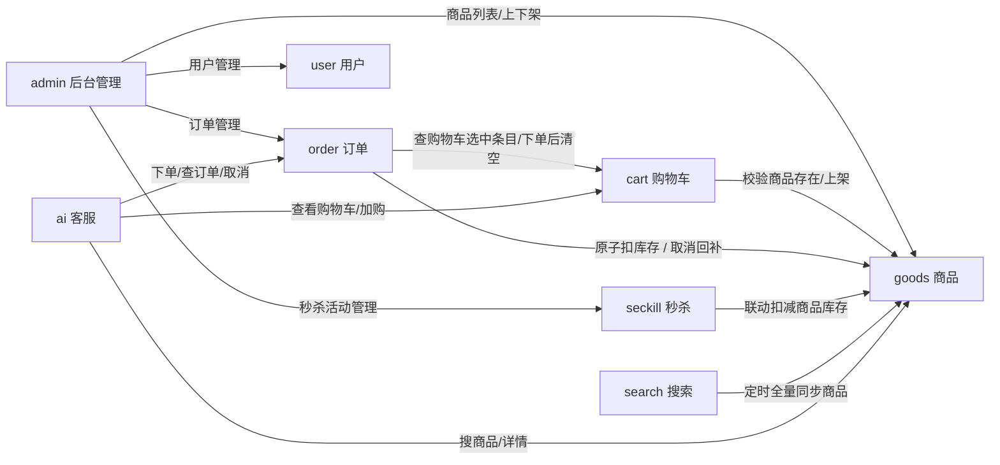
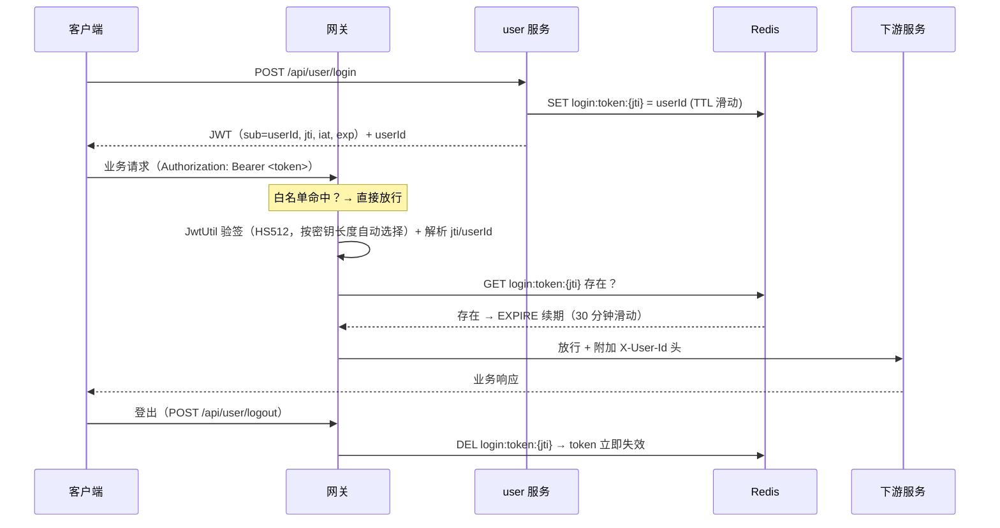
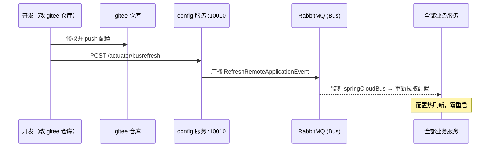
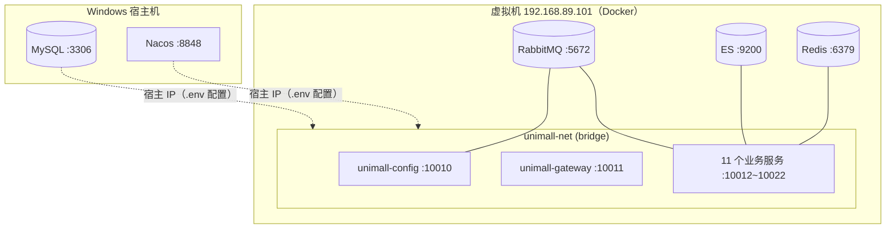

# UniMall 架构图

> 微服务商城系统（Spring Cloud Alibaba）整体架构、服务依赖、鉴权链路与配置加载说明。
> 相关文档：`AGENTS.md`（开发约定）、`DEPLOY.md`（Docker 部署）、`TESTING.md`（测试）。

## 一、总体架构图

```mermaid
flowchart TB
    subgraph Client["客户端"]
        Browser["浏览器前端<br/>http://localhost:5173"]
        Apifox["Apifox / curl"]
    end

    subgraph Edge["接入层（网关）"]
        GW["unimall-gateway :10011<br/>路由 /api/{服务}/**（StripPrefix=1）<br/>AuthGlobalFilter JWT 鉴权（order=-100）<br/>AdminProtectFilter 管理/内部接口拦截（order=-200）<br/>CORS"]
    end

    subgraph Platform["微服务（Nacos 注册发现 / Config 拉取配置）"]
        direction LR
        U["unimall-service-user :10012<br/>用户"]
        G["unimall-service-goods :10013<br/>商品"]
        C["unimall-service-cart :10014<br/>购物车"]
        O["unimall-service-order :10015<br/>订单"]
        SK["unimall-service-seckill :10016<br/>秒杀"]
        CM["unimall-service-comments :10017<br/>评论"]
        UP["unimall-service-upload :10018<br/>上传"]
        SM["unimall-service-sendmsg :10019<br/>短信/站内信"]
        S["unimall-service-search :10020<br/>搜索"]
        A["unimall-service-admin :10021<br/>后台管理"]
        AI["unimall-service-ai :10022<br/>AI 客服"]
    end

    subgraph Infra["基础设施"]
        Nacos["Nacos 注册中心<br/>127.0.0.1:8848"]
        Config["unimall-config 配置中心 :10010<br/>gitee git 模式 + Bus 热刷新"]
        MySQL[("MySQL<br/>:3306/unimall")]
        Redis[("Redis<br/>:6379")]
        ES[("Elasticsearch<br/>:9200")]
        MQ[("RabbitMQ<br/>:5672")]
    end

    subgraph External["外部"]
        Gitee["gitee 私有仓库<br/>unimall-config-dev"]
        DeepSeek["DeepSeek API<br/>(OpenAI 兼容)"]
    end

    Browser --> GW
    Apifox --> GW
    GW -->|lb:// + Nacos 负载均衡| Platform

    Nacos -.->|注册 / 发现| Platform
    Config -.->|拉取 {服务}-dev.yml| Platform
    Gitee -.->|GITEE_TOKEN 拉取| Config

    Platform --> MySQL
    Platform --> Redis
    S --> ES
    Platform -.->|Bus 刷新广播| MQ
    AI -->|HTTP| DeepSeek
```

## 二、服务间调用关系（OpenFeign 直连，不经网关）



> 内部接口约定：各服务 `/internal/**` 与 `/goods/batch|deduct|restore` 仅供服务间 Feign 直连，**不走网关**（网关 `AdminProtectFilter` 拦截普通用户访问）。

## 三、鉴权链路（JWT + Redis 白名单 + 滑动续期）



- **管理面**：admin 独立 JWT + Redis `admin:token:` 白名单，鉴权在 admin 服务内部拦截器（不走网关校验，网关 `/api/admin` 整体放行）
- **AI 客服**：走用户鉴权，`X-User-Id` 透传；`AiTools` 每请求 new 绑定用户身份，经 Feign 调 goods/cart/order

## 四、配置加载与动态刷新（Bus）



- 本地引导配置：端口、应用名、Nacos 地址、`spring.config.import: configserver:http://127.0.0.1:10010`
- 业务配置（数据源/Redis/JWT/路由）在 gitee 仓库 `unimall-config-dev`（共享 `application.yml` + `{name}-dev/{name}-dev.yml`，`search-paths: '*-dev'`）
- config 自身是 Server，不拉 gitee 共享配置（git/RabbitMQ/端点暴露在本地 application.yml）

## 五、关键组件速览

| 组件 | 选型 | 关键点 |
|---|---|---|
| 统一入口 | Spring Cloud Gateway（WebFlux） | 9+ 条路由 `lb://`，JWT 鉴权 + 管理接口保护 + CORS |
| 注册中心 | Nacos 2.3.x（独立部署） | 8848(HTTP)/9848(gRPC) |
| 配置中心 | Spring Cloud Config Server（git 模式） | gitee 私有仓库 + `GITEE_TOKEN` + Bus 热刷新 |
| 服务间调用 | OpenFeign + LoadBalancer | 2023.0 系无 Ribbon，显式引入 |
| 数据库 | MySQL 8 + MyBatis-Plus | 逻辑删除统一 `deleted` 字段 |
| 缓存/会话 | Redis | 登录白名单、秒杀防超卖（Lua）、AI 会话、验证码 |
| 搜索 | Elasticsearch 8.x | IK + 拼音分词，定时同步 goods |
| 消息 | RabbitMQ（Bus） | 配置动态刷新广播 |
| AI 客服 | Spring AI 1.0.0 + DeepSeek | `@Tool` 函数调用 + SSE 流式，支付不代付 |
| 部署 | Docker（虚拟机）+ docker-compose | 13 个服务镜像，`DEPLOY.md` 详见 |

## 六、部署拓扑（Docker 方案 A）


